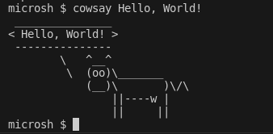

# MicroSH

MicroSH is a really tiny shell that can execute commands!
You can:
* use `cd`
* set environment variables via `export`
* print environment variables via `echo` (and use it regular way tho xP)
* not use arrows for prevous commands